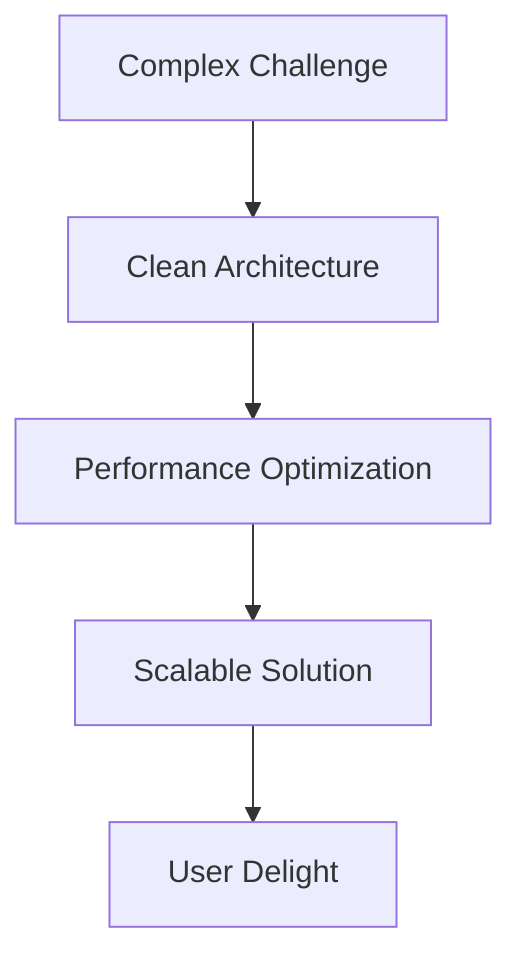

# 🚀 Ahmed Elfirgany - Flutter Developer
---
> "I don't just write code - I architect solutions that scale and perform"

<div align="center">
  
[](https://flutter.dev)
[](https://dart.dev)
[](https://github.com/saqrelfirgany/flutter_template)
[]()
[](https://github.com/saqrelfirgany)

</div>

```dart
// My approach to every challenge
void solveProblem(ComplexRequirement requirement) {
  final architecture = CleanArchitecture();
  final optimization = PerformanceTuning();
  final solution = ScalableProduct(requirement);
  deploySolution(solution);
}
```

## 🔥 Performance-Driven Flutter Architect

I transform complex requirements into high-performance mobile solutions. With **5+ years** of full-cycle development experience, I've architected apps serving **200K+ users** across healthcare, real estate, retail, and service ecosystems.

**My signature blend:**
- 🚀 **60% UX improvement** at Aqarmap
- 📱 **12+ published apps** 
- ⚡ **Real-time systems** mastery
- 🏗️ **Clean Architecture**

---

## 📬 Connect With Me

| Platform | Link |
|----------|------|
| **Email** | [saqrelfirgany@gmail.com](mailto:saqrelfirgany@gmail.com) |
| **Phone** | [+201025592065](tel:+201025592065) |
| **LinkedIn** | [Ahmed Elfirgany](https://www.linkedin.com/in/sa2r-elfirgany/) |
| **GitHub** | [saqrelfirgany](https://github.com/saqrelfirgany) |

---

## 🚀 Open Source Leadership

### [Flutter Enterprise Template](https://github.com/saqrelfirgany/flutter_template) 

```bash
# Production-ready foundation
flutter create --template=repository your_app
```

**Architecture Highlights:**
```
lib/
├── presentation # UI Layer
├── domain      # Business Logic
└── data        # Data Sources
```

| Feature | Implementation | Impact |
|---------|----------------|--------|
| **State Management** | BLoC/Cubit | Predictable state transitions |
| **Networking** | Dio + Interceptors | 40% faster debugging |
| **Theming** | Dynamic Dark/Light | 30% faster brand adaptation |

---

## 🧠 Technical Philosophy



**I specialize in:**
- 🔍 Identifying and eliminating performance bottlenecks
- 🏗️ Building future-proof app foundations
- ⚙️ CI/CD pipeline implementation
- 📱 Adaptive UI systems (Mobile ↔ Tablet ↔ Desktop)

---

## 📱 Application Portfolio

### 💼 Enterprise Solutions
| Project | Impact | Tech Stack | Links |
|---------|--------|------------|-------|
| **Flutter Enterprise Template** |  Production architecture | Clean Arch, BLoC, CI/CD | [GitHub](https://github.com/saqrelfirgany/flutter_template) |
| **Aqarmap CRM** | 4.7★ real estate solution | REST APIs, Performance Opt | [Play](https://play.google.com/store/apps/details?id=com.project.aqarmap.crm) \| [App Store](https://apps.apple.com/us/app/am-live-companies-only/id1271197604) |
| **Smartware ESS** | HR for 50K+ employees | SQL, Real-time Sync | [Play](https://play.google.com/store/apps/details?id=sa.com.takamoltbs.selfservices) \| [App Store](https://apps.apple.com/sa/app/tbs-self-services/id6447533663) |

### 🌐 Multi-Domain Applications
| Project | Domain | Key Achievement | Links |
|---------|--------|-----------------|-------|
| **Approved KSA** | Healthcare | Telemedicine platform | [Play](https://play.google.com/store/apps/details?id=com.namaait.approved) \| [App Store](https://apps.apple.com/eg/app/approved-ksa/id1668993553) |
| **AlNasser** | Retail | E-commerce solution | [Play](https://play.google.com/store/apps/details?id=com.namaait.alnasser) \| [App Store](https://apps.apple.com/us/app/alnasser/id6443395471) |
| **BizBuradayız** | Service | Marketplace ecosystem | [Play](https://play.google.com/store/apps/details?id=com.namaait.bizburadayiz) \| [App Store](https://apps.apple.com/eg/app/bizburaday%C4%B1z/id6468649321) |

---

## 📱 Comprehensive Applications List

| Project | Company | Domain | Links |
|---------|---------|--------|-------|
| **Aqarmap Egypt** | Aqarmap | Real Estate | [Play Store](https://play.google.com/store/apps/details?id=com.aqarmap.android) \| [App Store](https://apps.apple.com/us/app/aqarmap-egypt/id642633889) |
| **Aqarmap CRM** | Aqarmap | Real Estate | [Play Store](https://play.google.com/store/apps/details?id=com.project.aqarmap.crm) \| [App Store](https://apps.apple.com/us/app/am-live-companies-only/id1271197604) |
| **EPM (Tablet)** | Smartware | Project Management | [Website](https://smartwareltd.com/EPM.html) |
| **ESS (TBS)** | Smartware | HR Solutions | [Play Store](https://play.google.com/store/apps/details?id=sa.com.takamoltbs.selfservices) \| [App Store](https://apps.apple.com/sa/app/tbs-self-services/id6447533663) |
| **Adam Pharmacy** | NamaaIT | Healthcare | [Play Store](https://play.google.com/store/apps/details?id=com.namaait.adampharmacy) \| [App Store](https://apps.apple.com/eg/app/adam-pharmacy/id1672276218) |
| **AlNasser** | NamaaIT | Retail | [Play Store](https://play.google.com/store/apps/details?id=com.namaait.alnasser) \| [App Store](https://apps.apple.com/us/app/alnasser/id6443395471) |
| **BizBuradayız** | NamaaIT | Service Marketplace | [Play Store](https://play.google.com/store/apps/details?id=com.namaait.bizburadayiz) \| [App Store](https://apps.apple.com/eg/app/bizburaday%C4%B1z/id6468649321) |
| **BizBuradayız Driver** | NamaaIT | Service Provider | [Play Store](https://play.google.com/store/apps/details?id=com.namaait.bizburadayiz.driver) \| [App Store](https://apps.apple.com/eg/app/bizburaday%C4%B1z-sa%C4%9Flay%C4%B1c%C4%B1/id6468649619) |
| **Approved KSA** | NamaaIT | Healthcare | [Play Store](https://play.google.com/store/apps/details?id=com.namaait.approved) \| [App Store](https://apps.apple.com/eg/app/approved-ksa/id1668993553) |
| **Flutter Enterprise Template** | Open Source | Dev Tools | [GitHub](https://github.com/saqrelfirgany/flutter_template) |

---

<div align="center">
  
[]()
[](mailto:saqrelfirgany@gmail.com)
  
</div>
